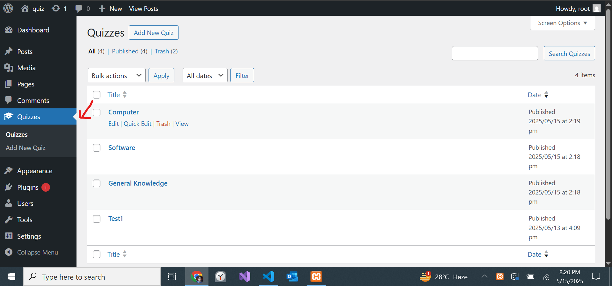
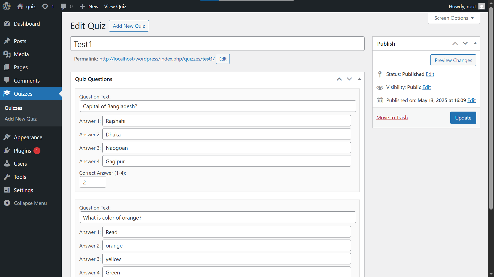
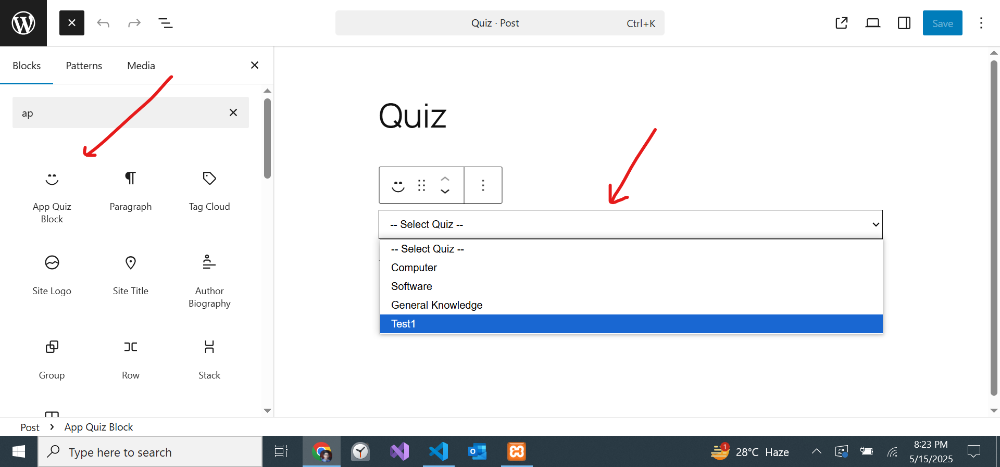
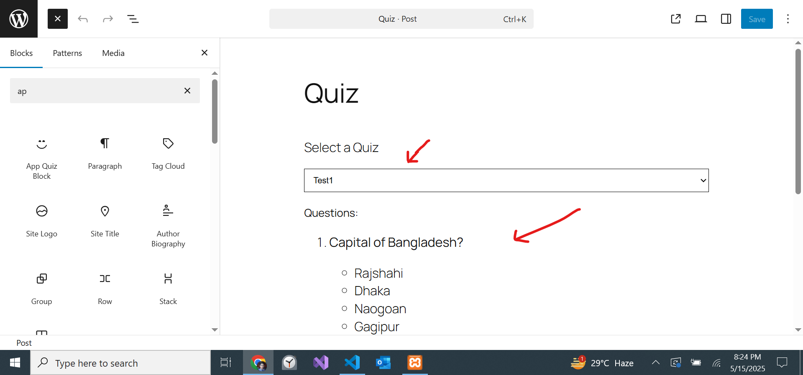
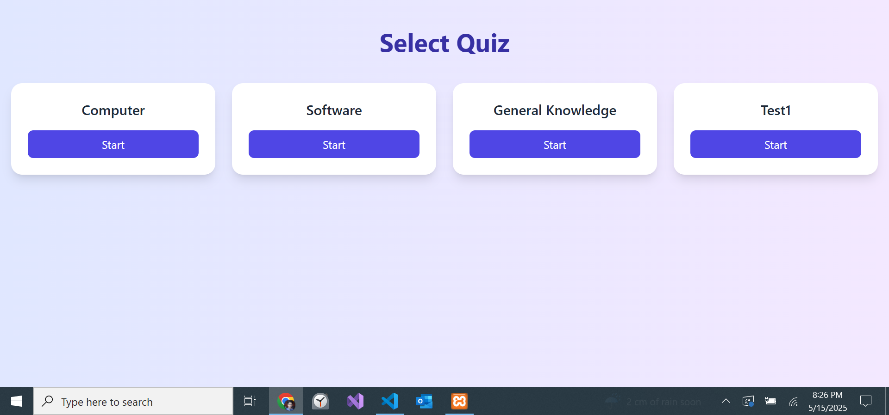
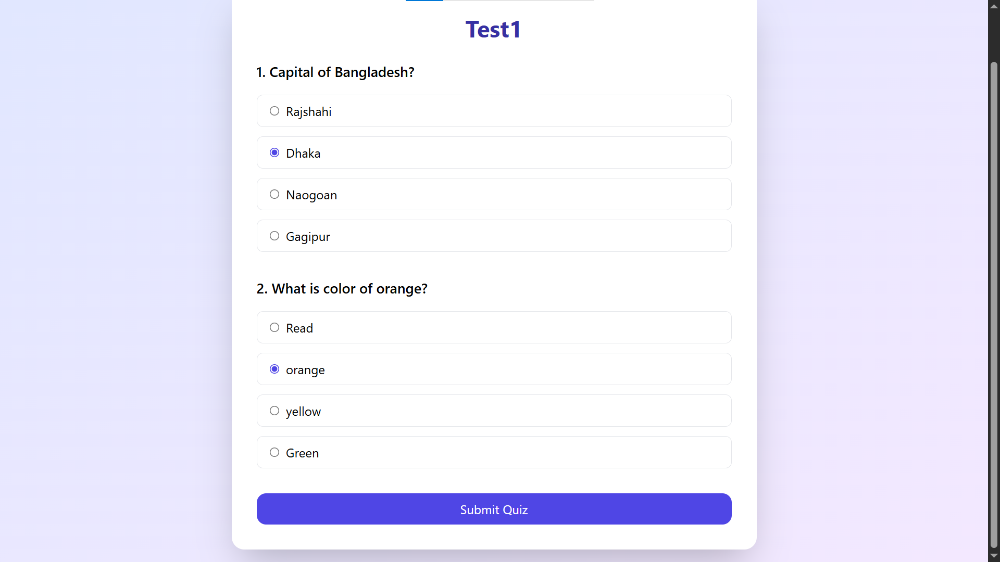
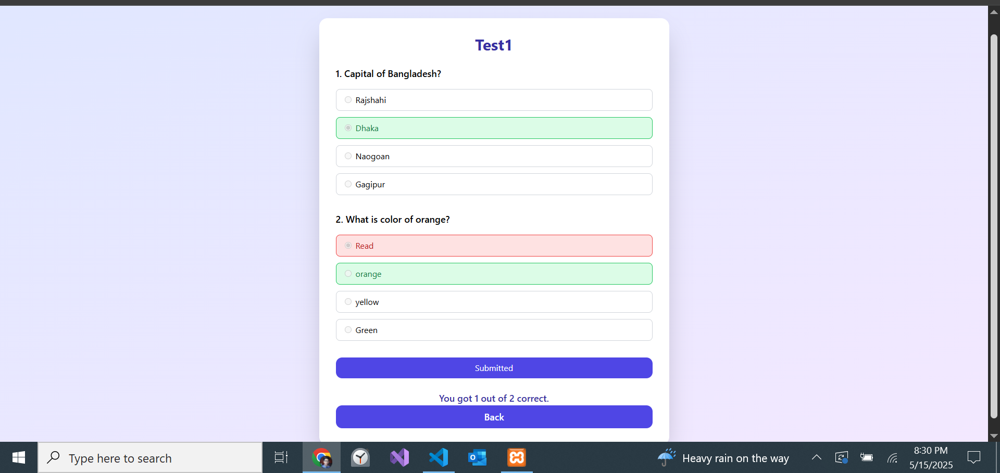

# React-Based Quiz Plugin with Gutenberg Block

- Make quiz list by post quiz plugin
- Gutenberg Block from dropdown selete each quiz post and show
- React ForontEnd we featch REST API of quiz
- Give quiz test form UI get result of attemped quiz

### Setup guide

#### Admin Features 

- inside wp-content -> plugins create `react_app_quiz_plugin` folder
- then past this `build` , `includes` folders and `react_app_quiz_plugin.php` file
- then activate plugin 

#### Frontend Quiz App (React)

- copy frontend-api-ui
- open terminal then run `npm install`
- then run `npm start`

### Admin Features 

- after active plugin we see the Quizes on admin panel

- Add new quiz 
- Title • List of questions • Question text • 4 answer choices • One correct answer 

- Gutenberg Block
- Select the post of quiz
- then show the quiz list 

### UI Features

- Frontend Quiz App (React)
- Fetch questions and options via REST API
- User selects answers and submits quiz
- Compare user responses with correct answers 

Thank you.

